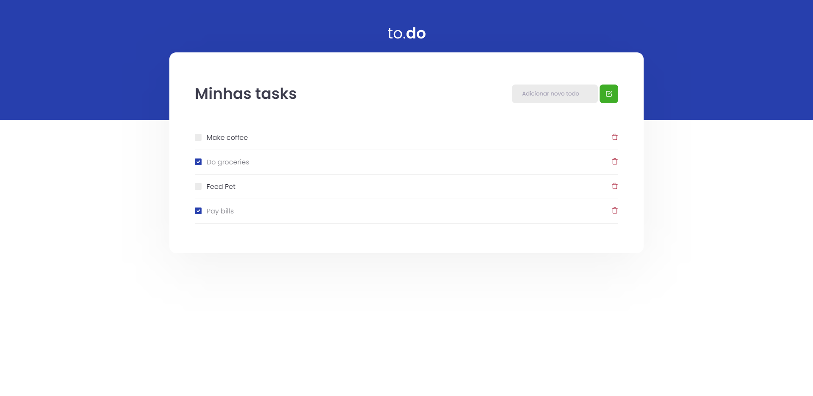

# To.do Challenge 🚀

A simple Task/ToDo manager made wit [Typescript](https://www.typescriptlang.org/) and [Sass](https://sass-lang.com/), as a challenge by Rocketseat's Ignite course.
</br>
</br>

## Screenshots



## ⚒  Tools
<ul>
<li>Typescript</li>
<li>Sass</li>
<li>State Hooks</li>
</ul>

# 🔥 Run this Application


## yarn

Clone this repo

```bash
git clone https://github.com/alanhcrdz/never-stop-tasking
```

```bash
#install dependencies
yarn
```

```bash
#start project
yarn dev
```
## npm


```bash
#install dependencies
npm install
```

```bash
#start project
npm run dev
```
## License 📃 </br> 
[](https://lbesson.mit-license.org/)
<p align="center">Made by <a href="https://linkedin.com/in/alanharlen">Alan Harlen</a>. Learned from <a href="https://rocketseat.com.br">Rocketseat</a></p>

